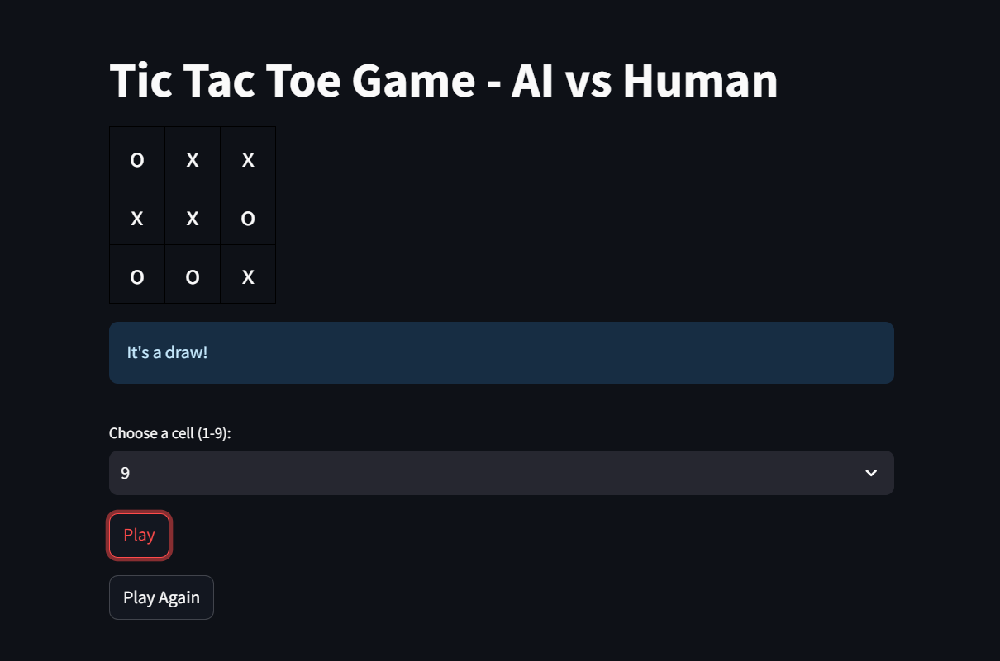

# 🎮 Tic Tac Toe - AI vs Human (with MCTS Reinforcement Learning)



This is a Python-based Tic Tac Toe game where a human player competes against an AI trained using **Monte Carlo Tree Search (MCTS)** — a reinforcement learning strategy widely used in decision-making games like Go and Chess.

The user interface is built using **Streamlit**, offering a lightweight, interactive, and visually appealing experience right in your browser.

---

## 🚀 Features

- ✅ Human vs AI gameplay
- 🧠 AI built using Monte Carlo Tree Search
- 🎯 Smart decision-making with exploration/exploitation balance
- 📦 Simple interface (CLI or extendable to web apps)
- ⚖️ Detects Win, Loss, and Draw scenarios

---

## 🧠 MCTS Overview

**Monte Carlo Tree Search** (MCTS) is a heuristic search algorithm that builds a search tree using random simulations. The MCTS in this project follows these four main steps:

1. **Selection**: Traverse the tree using the Upper Confidence Bound (UCB1) to find the best node.
2. **Expansion**: Add a new node for one of the possible future states.
3. **Simulation (Rollout)**: Play a random game from the newly expanded node.
4. **Backpropagation**: Update the nodes along the path with the simulation result.

---

## 🧩 How the Game Works

- The game board is a 3x3 grid.
- The user plays against an AI bot (Player `'x'` or `'o'`).
- AI uses 800 iterations of MCTS to choose its move.
- The game ends with a **win**, **loss**, or **draw**.

---

## 🗂️ Project Structure
📁 tic-tac-toe-mcts/
├── mcts.py # Contains MCTS and treeNode classes
├── tic-tac-toe.py # Game state, move generation, win/draw logic
├── app.py # Main game loop (CLI or web-based)
├── README.md # You're here!


---

## 🧪 Sample Code Snippet

```python
# Rollout function inside MCTS
def rollout(self, board):
    while not board.is_win():
        try:
            board = random.choice(board.generate_states())
        except:
            return 0
    return 1 if board.player_2 == 'x' else -1
```

## 🎯 How to Run

### 1. Install Dependencies

Make sure Python is installed on your system. Then install Streamlit using:

```bash
pip install streamlit
````

### 2. Run the App

Use the following command:

```bash
streamlit run tic-tac-toe.py
```


## 📌 TODOs / Improvements

* [ ] **Add difficulty levels**
  Implement multiple difficulty settings by adjusting the number of MCTS iterations (e.g., Easy: 100, Medium: 400, Hard: 800+).

* [ ] **Highlight winning combinations**
  Visually highlight the 3 winning cells when someone wins (e.g., green border or glow).

* [ ] **Track user vs AI score history**
  Add a scoreboard to track wins, losses, and draws across multiple rounds.

* [ ] **Add sound effects for moves**
  Play audio feedback for clicks, wins, and draws to improve game interactivity.

---

## 🤖 Built With

* **Python** – for game logic, AI, and backend logic.
* **Streamlit** – for creating the interactive GUI in the browser.
* **Monte Carlo Tree Search (MCTS)** – used for reinforcement learning-based AI move selection.

---

## 📄 License

This project is licensed under the **MIT License**.
Feel free to use, modify, and share this project with attribution.

---

> ⚔️ Challenge the AI. Learn MCTS. Enjoy the game!

